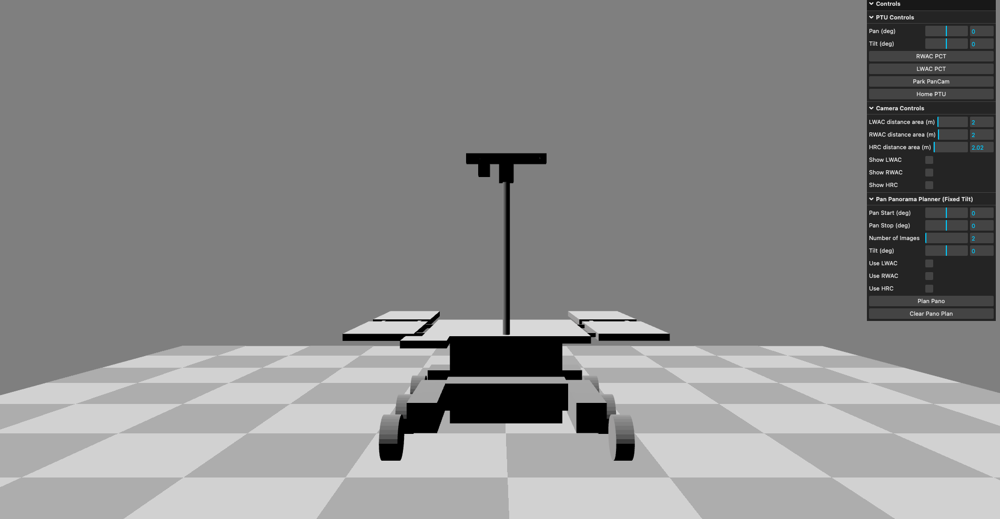
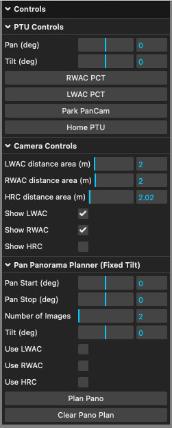
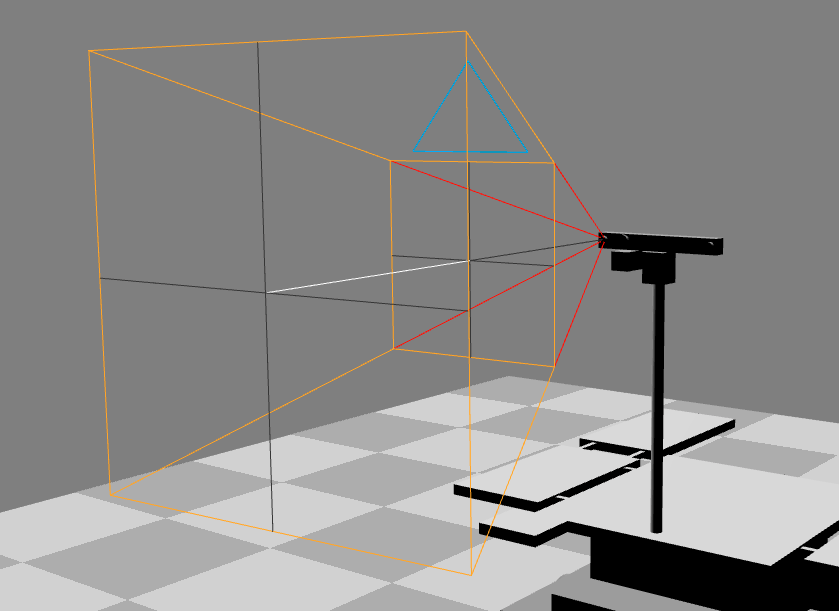
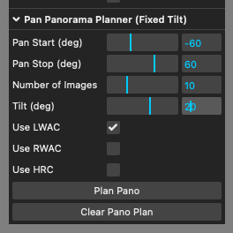
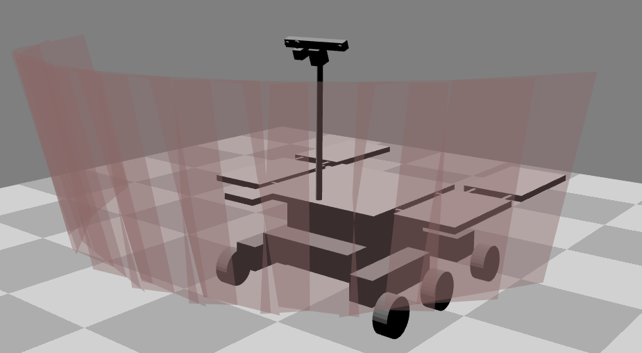
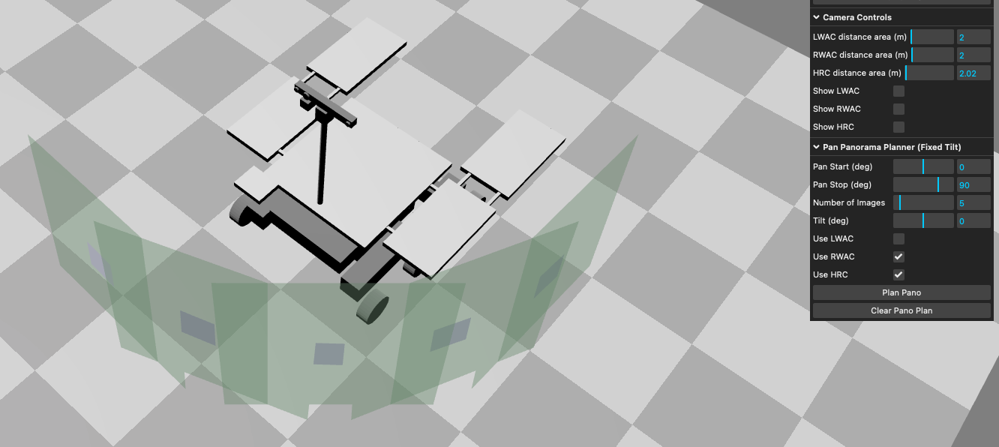
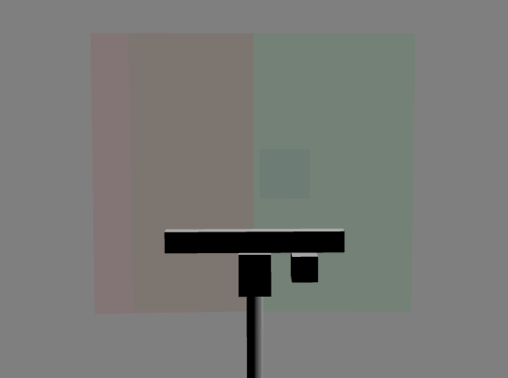
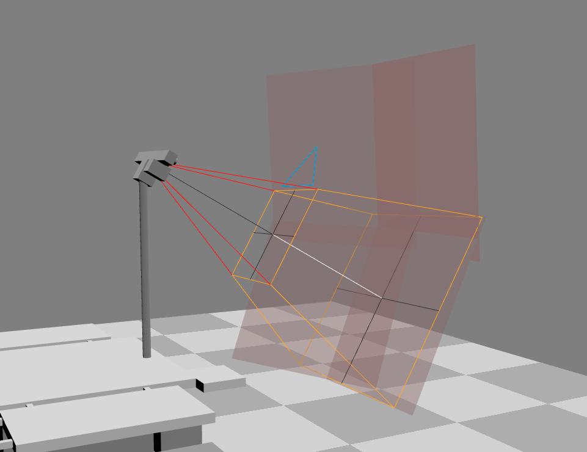

# visPTU

A quick and simple web tool to visualising PTU and camera views. 

See me running at: https://au-exomars.github.io/visPTU/

## How to use

When you access the link, you will see this:



The main window contains a very simple model of the rover, and a control panel. 

You can move the view using the mouse/trackpad:
- Left click and drag to orbit the rover
- Right click and drag to move the view
- Scroll wheel to zoom

### Control Panel 



The control panel (above) has several collapsible sections and lots of options to play with:

#### PTU and Camera Controls

**PTU Controls**
- Pan and Tilt sliders (or number entry).
- several presets for Pan Tilt angles.

**Camera Controls**
- Visual representations of the camera view frustums (example shown below), which show the extent of the camera's field of view; you can toggle these on/off individually.
- sliders that allow for different distances of the cameras 'far point'.



#### Panorama Planner

At present the panorama planner is limited as I would like to cosult with users on the controls - if you have ideas, let me know!



A panorama is specified as start-stop pan angles, with the number of images between. You can set a fixed tilt angle and choose which camera(s) to use.

In the example above, I have requested a panorama starting at -60 degrees and ending at +60 degrees, formed of 10 images. I only want the LWAC, and have a fixed tilt of 20 degrees.

Click "Plan Pano" to generate the panorama to that spec:



You can select "Clear Pano Plan" to reset, and respec a new panorama, e.g.:



In this example, we are using RWAC and HRC together.

## Tips

LWAC = Red, RWAC = Green, HRC = Blue



You can add multiple sections by not clicking "Clear Pano Plan"



## Development Environment

Dependencies: Node
```
npm install --save three
npm install --save-dev vite  
```

Run with:
```npx vite ```

Build dist with:
```npx vite build ```